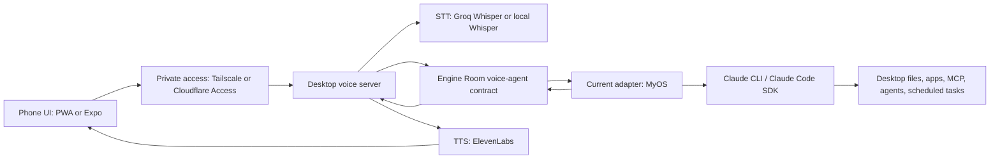

# MyOS Mobile Voice Agent Redesign

## Boundary

The mobile voice agent has two different homes:

- **Engine Room**: portable contract, preferences, policies, and system design.
- **Runtime projects**: runnable phone UI, desktop server, TTS/STT integrations, tunnels, and service launchers.

The actual app should not be buried inside the Engine Room, because it is provider/runtime-specific code. But the voice-agent design contract should live here so it survives provider changes.

## Goal

Build a phone-friendly voice console for the current desktop AI stack. It should feel like ChatGPT/Gemini-style voice chat, while the actual execution host remains the desktop.

MyOS is the current execution provider. The interface should be designed so another provider can be plugged in later without rewriting the Engine Room.

## Current Bones

- `~/HQ`: MyOS OS, current execution provider.
- `~/HQ/dist/agent-voice-bridge.js`: current direct voice-to-MyOS bridge.
- `~/workspace/operations/engine-room`: portable system layer.
- `~/sage-voice`: existing React voice UI.
- `~/sage-voice-native`: existing Expo mobile wrapper.
- `~/sage-voice-server`: existing desktop orchestration backend.

## Architecture



## Design Rules

1. The phone app is an interface, not the trusted execution host.
2. The desktop server owns orchestration and keeps secrets off the phone.
3. Engine Room stores portable rules, preferences, adapter contracts, and decisions.
4. MyOS is the current adapter, not the permanent boundary.
5. ElevenLabs stays as the TTS engine.
6. Direct CLI/SDK calls are preferred over compatibility gateways.
7. Dangerous desktop actions require explicit confirmation.

## Interaction Modes

- **Hold to Talk**: press and hold, release sends the utterance.
- **Tap Start / Tap Stop**: tap once to record, tap again to send.
- **Conversation**: listens again after Sage finishes speaking.
- **Brain Dump**: captures longer speech, then asks the engine to structure it.
- **Meeting**: routes discussion to agents and produces minutes.
- **Command Mode**: optimized for desktop tasks, with confirmation before risky work.

## Backend Contract

- `POST /api/transcribe`: audio blob to text.
- `POST /api/chat`: text to current engine response.
- `POST /api/tts`: response text to ElevenLabs audio stream.
- `GET /api/health`: checks adapter, engine root, STT, and TTS readiness.

## Current MyOS Adapter

The current chat path calls:

```bash
node /Users/sagecos1/HQ/dist/agent-voice-bridge.js \
  --agent main \
  --chat-id voice:<session-id> \
  --message "<transcribed text>"
```

Specialized agent calls can pass `--agent mason`, `--agent charter`, `--agent marlow`, and so on where those agents exist in MyOS.

## Mobile Access

Preferred order:

1. **Tailscale** for personal mobile access.
2. **Cloudflare Tunnel + Access** for a stable authenticated URL.
3. **ngrok** only for short-lived testing.

The server should never be exposed without auth because it can invoke desktop automation.

## Rebuild Plan

1. Keep this decision and adapter contract in the Engine Room.
2. Keep runtime code in `sage-voice`, `sage-voice-native`, and `sage-voice-server` or a future dedicated project folder.
3. Introduce a provider adapter boundary: `MyOSAdapter` first, future providers later.
4. Move all secrets to backend env vars.
5. Keep ElevenLabs behind backend endpoints.
6. Simplify the mobile UI around the core voice loop first.
7. Add command confirmation and audit log.
8. Package as PWA, then keep Expo as the native shell if push notifications or native audio controls matter.

